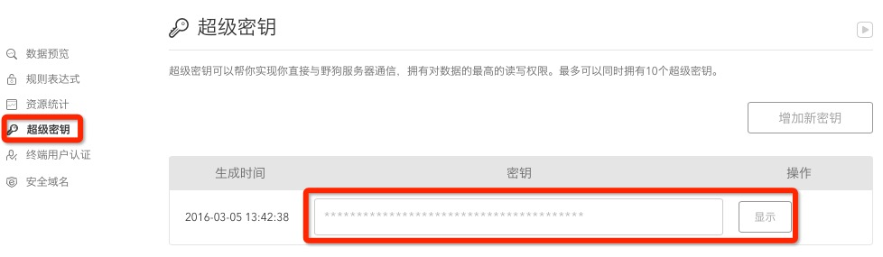

# lib-im-kit
这是基于 WildIMLib 开发的 WildIMKit 库，可直接使用 WildIMKit 库实现聊天界面的搭建。

# iOS IMKit SDK 开发指南
## 前期准备
### 一、注册开发者账号
请前往 [野狗官方网站](https://www.wilddog.com/my-account/signup) 注册开发者帐号。

### 二、创建应用
注册了开发者账号之后，在进行开发 App 之前，您需要请前往 [野狗开发者控制面板](https://www.wilddog.com/dashboard) 创建应用。

### 三、下载与导入 SDK
#### SDK 分类
野狗 IM 提供两类 SDK：  
	1、野狗 IM 界面组件 - WildIMKit  
	2、野狗 IM 通讯能力库 - WildChatLib  
#### 导入SDK   
##### 通过 CocoaPods 管理依赖
野狗建议使用 [CocoaPods](https://cocoapods.org/) 管理工程的依赖。关于 CocoaPods 的入门，请参考： [CocoaPods getting started](https://guides.cocoapods.org/using/getting-started.html)。
打开工程目录，新建一个 Podfile 文件

	$ cd your-project-directory
	$ pod init
	$ open -a Xcode Podfile # opens your Podfile in XCode

然后在 Podfile 文件中添加以下语句

	target 'your-target-name' do
	pod 'Wilddog'
	pod 'WildChatLib'
	pod 'WildIMKit'
	end
	
最后安装 SDK

	$ pod install
	$ open your-project.xcworkspace
	
## IMKit 快速集成
如果您已经阅读了上面的文档内容，并准备好工程和 AppKey 相关事宜，则可以参考野狗即时通讯功能。

### 一、工程准备
打开按照上面“前期准备”操作生成的 .xcworkspace 文件

### 二、初始化 SDK
在您需要使用野狗 SDK 功能的类中，import 相关头文件。  

	#import <WildIMKit/WildIMKit.h>

通过 WildIM 的单例，用 initWithAppKey: 初始化 SDK。在 App 的整个生命周期中，您只需要将 SDK 初始化一次。

	[[WildIM sharedWildIM]initWithAppKey:@"YourTestAppKey"];
	
其中，SDK 中 appKey 为 `@"https://<appId>.wilddogio.com"` 中的 `<appId>`。  
例如：`https://YourTestAppKey.wilddogio.com/` 的 appKey 为 `YourTestAppKey`。

### 三、获取 Token

App 开发都有自己的帐户系统，野狗使用 [JWT token](https://jwt.io) 结合超级密钥生成 Token 来集成 APP 用户 ID 和 昵称。在野狗帐号控制面板中进入应用中，在左侧功能栏中找到超级密钥。用户可以自行生成 token，只需符合格式约定。token 采用标准的 jwt 格式，payload部分中，必须包含的字段如下：[更多信息请参考文档](https://z.wilddog.com/rule/guide) 中第五节自定义 token。

| 字段 | 描述 |
| --- | --- |
| v | token 的版本，默认是数字 0  |
| iat | token 的颁发时间，Unix 时间秒数 |
| d | 认证数据。token 的 payload，必须包含 uid 字段，对应规则表达式中的 `auth` 变量|

下面是可选参数：

| 字段 | 描述 |
| --- | --- |
| nbf | token 在之前（缩写"not before"）时间不会生效|
| exp | token 过期的时间戳，以秒为单位 |
| admin | 如果设置为 true，将获得完全的读写权限|
| debug | 如果设置为 true，将在安全和规则表达式失败时提供详细的错误信息|


一个示例的 token payload：

``` 
{
    "v" : 0,
    "iat" : 1437520447,
    "d" : {
        "uid" : "sampleId"
    },
    "admin" : true,
    "exp" :  1437845927
}
```

使用 SHA-256 HMAC 签名，生成标准的 jwt 即可。

### 四、连接服务器

将您在上一步获取到的 Token，通过 WildIM 的单例，传入 `-connectWithToken:success:error:tokenIncorrect:` 方法，即可建立与服务器的连接。

```
[[WildIM sharedWildIM]connectWithToken:@"YourTestUserToken" success:^(NSString *userId) {
       NSLog(@"登陆成功。当前登录的用户ID：%@", userId);
        });
     } error:^(int errCode) {
            NSLog(@"登陆的错误码为:%d", errCode);
     } tokenIncorrect:^{
           NSLog(@"token 无效，请确保生成token 使用的appkey 和初始化时的appkey 一致");
}];

```

### 五、启动聊天界面

野狗 IMKit 中已经实现了聊天界面，您直接使用或继承 WildConversationViewController，即可快速启动和使用聊天界面。

如下面的例子，创建一个 WildConversationViewController 对象并设置好会话类型、目标会话 ID，显示即可进行聊天。

```
//新建一个聊天会话View Controller对象
WildConversationViewController *chat = [[WildConversationViewController alloc]init];
//设置会话的类型，如单聊、群聊
chat.conversationType = Wild_C2C;
//设置会话的目标会话ID。（
chat.targetId = @"targetIdYouWillChatIn";
//显示聊天会话界面
[self.navigationController pushViewController:chat animated:YES];

```
